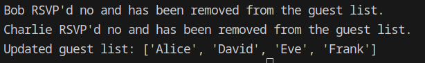

# Practice: Lesson Title

## Overview:

> *Students will be able to use a user-defined function to remove items from a Python list*

## Submitting Your Work:

> Save your files to a GitHub repo named: ***manage-list-with-function***

## Sample Output

## Resources:

- [Python index ( ) method](https://www.w3schools.com/python/trypython.asp?filename=demo_ref_list_index)
- [Handling errors with try/except block in Python](https://www.w3schools.com/python/python_try_except.asp)

## Directions

- Add at least six party guests to a Python list named `guests`   

- Define a function named `remove_guest`   

    - Function will take two (2) parameters, `guest_name` and `response`   

- Add a `try-except` block to the body of your function   

- In the `try` block, use the Python `index()` method to get the index number of the guest name passed to the function; save this index number to a variable `guest_index`   

- Also in the `try` block, write an `if` statement that checks the guest's response to the party invitation
- If the guest responded *no* or *n* in your `try` block, use the `pop()` method to remove the guest from the `guests` list and print a sentence telling the user that guest has been removed from the `guests` list
- Create your `except` block using the keyword `except` and the built-in `ValueError` exception
- Your `except` block tells Python what to do when a guest name is not found in your `guests` list
- In your `except` block, use an **f-string** and the `print()` function to tell the user the guest was not found in the `guests` list
- Finally, call the `remove_guest()` function three times
    - As arguments, use the name of a guest and that guest's response to the party invitation
    - Example: `remove_guest('Mike', 'No')`
    - Example: `remove_guest('Alyssa', 'Yes')`
- Please also print the updated guest list at the end of your script
